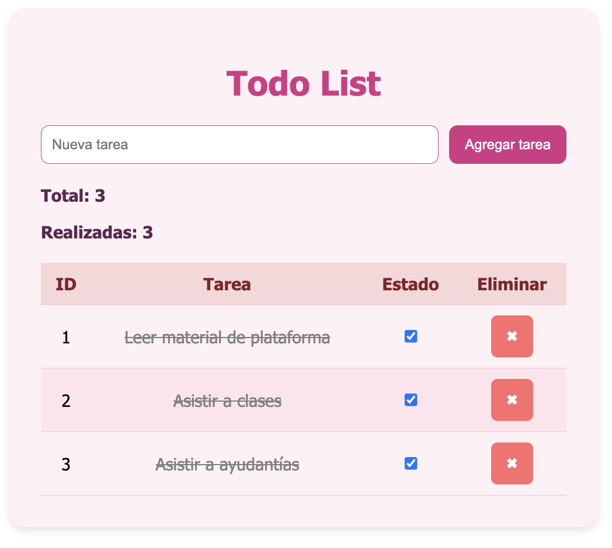

## Desafio 5: Todo List ##

Se deben agregar elementos dinámicamente en una página web que permita mantener un control de tareas pendientes.

Requerimientos:

1. Agregar tareas con descripción al llenar el input y presionar el botón agregar tarea, la tarea es agregada al arreglo y luego la lista en la página web se actualiza.

2. Borrar una tarea al hacer click en el botón que acompaña a la tarea. Se debe borrar el dato del arreglo y actualizar la lista.

3. Contar el total de tareas, mantener actualizada esta cuenta cuando se agregue una tarea nueva o se borre una tarea.

4. Marcar una tarea como completada al hacer click en un botón "cambiar" (o se puede utilizar un checkbox).
Pistas:
- Agregar al objeto el estado completado.
- Iniciar las tareas con completado: false.
- Al hacer click en el botón cambiar, se debe buscar el elemento por el índice y luego cambiar el estado a completado: true.

5. Contar el total de tareas realizadas
- Hint: filtrar y luego contar

6. El código incluye al menos 3 tareas iniciales en el arreglo y estas se muestran en la
página web recorriendo el arreglo (se puede utilizar for of o forEach)

Se ve así 

Se puede encontrar en github pages en https://marcemorales.github.io/Desafio5-TodoList/

------
Marcela Morales Peralta